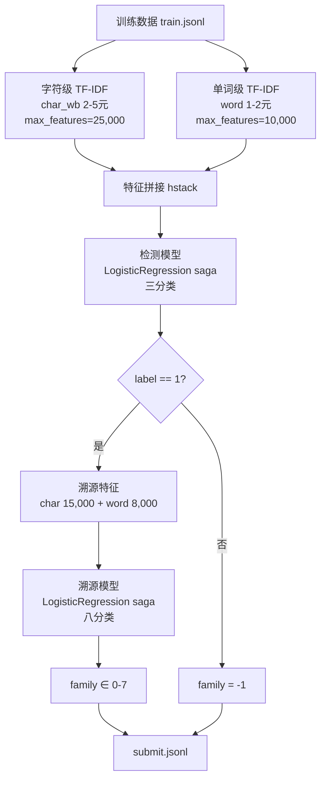

<div align="center">

# CCKS2026 大模型生成文本检测及溯源

**AI 生成文本检测与来源追踪 · 双阶段分类方案**

[](https://www.python.org/)
[](https://scikit-learn.org/)
[](LICENSE)
[]()
[]()
[]()

**阿里天池 CCKS2026 竞赛个人方案** · 采用 TF-IDF + Logistic Regression 双阶段分类
A 榜总分 **0.9125**（检测 F1 **0.9471** / 溯源 F1 **0.7740**）· 排名约 **95**

</div>

---

## 📌 项目简介

针对大模型生成文本的**真伪判别**与**来源追踪**问题，提出一套**轻量、高效、可复现**的双阶段分类方案：

- **检测（Detection）**：区分文本是 *人类撰写 / 纯机器生成 / 人机协作生成*（三分类）；
- **溯源（Source Tracing）**：对纯机器文本进一步判断其来自哪个模型家族（OpenAI / Alibaba / DeepSeek / ByteDance / Moonshot / Google / Anthropic / xAI，八分类）。

方案仅使用**统计特征（字符级 + 单词级 TF-IDF）**与**逻辑回归**，训练快速、部署简单，在无需 GPU 的前提下达到 A 榜 **0.9125** 的成绩，验证了传统机器学习方法在生成文本分析中的有效性，也为后续引入深度语义模型提供了清晰的改进基线。

## 🎯 竞赛背景

随着 AIGC 快速发展，大模型生成文本已广泛出现在新闻生成、教育辅导、社交媒体、智能办公等场景。文本生成门槛低、传播速度快，一旦被恶意使用，可能造成：

- ⚠️ 信息真实性下降
- ⚠️ 舆论误导
- ⚠️ 学术不端
- ⚠️ 内容责任模糊

因此，**检测 AI 文本并追踪其来源**，是当前自然语言处理领域的重要研究方向。

## 📋 任务定义

### 1️⃣ 文本检测（Detection）—— 三分类

| label | 含义 |
| :---: | :--- |
| 0 | 人类撰写 |
| 1 | 纯机器生成 |
| 2 | 人机协作生成 |

### 2️⃣ 来源溯源（Source Tracing）—— 八分类

当检测结果为 `label == 1` 时，进一步判断文本属于哪一个模型家族：

| 编号 | 模型家族 | 编号 | 模型家族 |
| :---: | :--- | :---: | :--- |
| 0 | OpenAI | 4 | Moonshot |
| 1 | Alibaba | 5 | Google |
| 2 | DeepSeek | 6 | Anthropic |
| 3 | ByteDance | 7 | xAI |

### 3️⃣ 评分规则

```
Final = 0.8 × F1_detect(macro) + 0.2 × F1_source(macro)
```

检测任务占 **80%**，溯源任务占 **20%**，均使用 Macro-F1，兼顾类别不均衡场景。

## 🗂️ 数据集

| 数据集 | 规模 | 说明 |
| :--- | :---: | :--- |
| `train.jsonl` | 98,800 条 | 三分类基本均衡（0=32,000 / 1=32,000 / 2=34,800），纯机器文本在 8 个模型家族间均匀分布（各 4,000 条） |
| `test_a_release.jsonl` | 12,350 条 | 无标签文本，用于线上评测（A 榜） |

> 💡 数据集体积较大（训练集约 160MB），未包含在本仓库中，请到[天池官网](https://tianchi.aliyun.com/)对应赛题页面下载后放置于项目根目录。

## 🧠 方案概览



### 关键设计

| 设计 | 说明 |
| :--- | :--- |
| 🔤 **双层特征互补** | 字符级 TF-IDF（`char_wb` 2-5 元）捕捉**标点习惯、句式结构、拼写模式**等风格特征；单词级 TF-IDF（`word` 1-2 元）捕捉**词汇搭配、常见短语**等内容特征；`hstack` 拼接后表达能力明显优于单一特征 |
| ⚙️ **双阶段分类** | 检测模型全量三分类；溯源模型仅用 `label == 1` 纯机器文本训练，特征参数微调以更细粒度区分模型风格 |
| 🚀 **Logistic Regression** | `saga` solver + `C=3.0`，天然支持稀疏矩阵、收敛快，适合大规模文本分类，训练效率高，便于快速迭代 |

## 📁 项目结构

```
CCKS2026-/
├── train_full.py      # 主训练脚本：双阶段模型训练 → 测试集预测 → 生成提交 + 保存模型
├── evaluate.py        # 本地验证：80/20 分层划分，估算线上得分
├── verify_submit.py   # 提交校验：检查 label / family 取值合法性
├── requirements.txt   # 依赖：numpy, scipy, scikit-learn
├── LICENSE            # MIT 许可证
└── README.md          # 项目说明（本文档）
```

## 🚀 快速开始

### 1. 安装依赖

```bash
pip install -r requirements.txt
```

### 2. 下载数据

从天池赛题页下载 `train.jsonl` 与 `test_a_release.jsonl`，放入项目根目录。

### 3. 本地验证（估算得分）

```bash
python evaluate.py --train train.jsonl
```

### 4. 训练并生成提交文件

```bash
python train_full.py \
    --train train.jsonl \
    --test test_a_release.jsonl \
    --output submit.jsonl \
    --model pipeline.pkl
```

### 5. 校验提交格式

```bash
python verify_submit.py --submit submit.jsonl
```

## 🏆 实验结果

线上（A 榜）成绩：

| 指标 | 分数 | 占比 |
| :--- | :---: | :---: |
| 检测 F1（Detection） | **0.9471** | 80% |
| 溯源 F1（Source Tracing） | **0.7740** | 20% |
| **总分** | **0.9125** | 100% |
| 排名 | 约 95 | — |

### 📊 结果分析

**✅ 优势**

- **检测能力强**（0.9471）：能较好区分人类 / AI / 协作文本；
- **双层特征互补有效**：字符 + 单词特征组合效果明显优于单一特征；
- **训练效率高**：LR 训练速度快、部署简单，适合比赛快速迭代。

**⚠️ 不足**

- **溯源任务较难**（0.7740）：不同模型生成风格趋同，区分难度大；
- **深层语义建模不足**：TF-IDF 属于浅层统计特征，无法建模上下文语义。

### 🔭 改进方向

1. **引入预训练模型**：BERT / RoBERTa / DeBERTa 提升语义表达能力；
2. **模型融合**：TF-IDF + BERT + XGBoost 提高鲁棒性；
3. **风格统计特征**：平均句长、标点密度、重复率、熵值等，增强来源识别能力。

## 📝 竞赛信息

| 项目 | 内容 |
| :--- | :--- |
| 赛题 | CCKS2026 大模型生成文本检测及溯源（LLM-Generated Text Detection and Source Tracing） |
| 平台 | 阿里天池（Tianchi） |
| 赛程 | 2026 年 6 月中旬 — 6 月底（A 榜提交阶段） |

## 📄 许可证

本项目基于 [MIT](LICENSE) 许可证开源。
